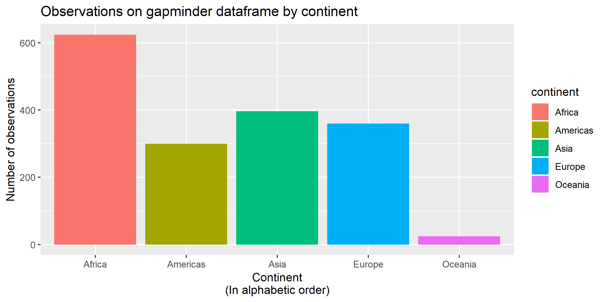

# Homework 05: Factor and figure management

## Overview

Goals:

* Reorder a factor in a principled way based on the data and demonstrate the effect in arranged data and in figures.
* Write some data to file and load it back into R.
* Improve a figure (or make one from scratch), using new knowledge, e.g., control the color scheme, use factor levels, smoother mechanics.
* Make a plotly visual.
* Implement visualization design principles.

Remember the [sampler concept](http://en.wikipedia.org/wiki/Sampler_(needlework)). Your homework should serve as your own personal cheatsheet in the future for canonical tasks. Make things nice -- your future self will thank you!

## The Assignment

### Part 1: Factor management

With the data set of your choice, after ensuring the variable(s) you're exploring are indeed factors, you are expected to:

1. Drop factor / levels;
2. Reorder levels based on knowledge from data.

We've elaborated on these steps for the gapminder and singer data sets below.

Be sure to also characterize the (derived) data before and after your factor re-leveling:

* Explore the effects of `arrange()`. Does merely arranging the data have any effect on, say, a figure?
* Explore the effects of reordering a factor and factor reordering coupled with `arrange()`. Especially, what effect does this have on a figure?

These explorations should involve the data, the factor levels, and some figures.

#### Elaboration for the gapminder data set

All dependencies used for this asssigment

```{r call packages, warning = FALSE}
suppressPackageStartupMessages(library(tidyverse))
library(ggplot2)
library(gapminder)
library(knitr)
library(kableExtra)
library(forcats)
library(scales)
knitr::opts_chunk$set(echo = TRUE)
```

**i) Drop Oceania.** Filter the Gapminder data to remove observations associated with the `continent` of Oceania.  Additionally, remove unused factor levels. Provide concrete information on the data before and after removing these rows and Oceania; address the number of rows and the levels of the affected factors.

First of all we are going to ensure that `gapmider`dataframe cotains factor data:

```{r structure}
str(gapminder)
```

As we can see by using command `str()` this dataframe has two variables of type **factor**, which are:

|  Variable   |   Levels   |
|-------------|------------|
| country     |     142    |
| continent   |      5     |

Then, if we filter by continents that are not *Oceania* we have:

```{r filter, warning = FALSE}
gapminder %>% 
  filter(continent != "Oceania") %>% 
  str() 
```

We can note that both *continent* and *country* **keep the same number of levels** than without filtering. This happens because we have empty levels on the filtered dataframe. In order to drop this kind of levels we can use `droplevels()`:

```{r filter_and_drop}
gapminder %>% 
  filter(continent != "Oceania") %>% 
  droplevels() %>% 
  str()
```

This time, the number of levels for continent changed from **5** to **4** as we dropped one level (*Oceania*). Furthermore, the number of levels in country changed from **142** to **140**, which means there are two countries associated to the continent *Oceania*. We can confirm it by:

```{r checking_results}
gapminder %>% 
   filter(continent == "Oceania") %>% 
   droplevels() %>% 
   str()
```

Finally, we can know the number of countries per continent on this dataframe by:

```{r levels_by_country}
gapminder %>% 
 filter(continent != "Oceania") %>% 
 droplevels() %>% 
 select(country, continent) %>% 
 group_by(continent) %>% 
 summarize(total = length(unique(country))) %>% 
 kable(col.names=c("Continent","Number of levels (countries)"))
```

Thus, we can confirm the other 140 levels (countries) correspond to the rest of continents.


**ii) Reorder the levels of `country` or `continent`.** Use the forcats package to change the order of the factor levels, based on a principled summary of one of the quantitative variables. Consider experimenting with a summary statistic beyond the most basic choice of the median.

If we dont't apply any kind of arrange to the dataframe, **R** consider the levels of a factor in alphabetic order. We can illustrate this by the following graph about the number of observations in `gapminder` by continent:

```{r without_order_criteria}
first_plot <- ggplot(gapminder,aes(continent, fill = continent)) +
                geom_bar() +
                ggtitle("Observations on gapminder dataframe by continent") +
                xlab("Continent\n(In alphabetic order)") +
                ylab("Number of observations")
first_plot
```

But we can provide a different cirteria for the order of factors, for example, if we want to show the number of observations in the dataframe by continent, considering the order given by the `variability`of **life expectancy**:

```{r with_order_criteria}
gapminder %>%
  mutate(continent = fct_reorder(continent, lifeExp, .fun = sd)) %>% 
  ggplot(aes(continent, fill = continent)) +
  geom_bar() +
  ggtitle("Observations on gapminder dataframe by continent") +
  xlab("Continent\n(From the highest variability of life expectancy to the lowest)") +
  ylab("Number of observations")
```

It allows to appreciate that *Oceania*, the continent with the fewest number of observations, has the lowest variability on the records of life expectancy, while Asia is the continent with the greatest variability on life expectancy but it has not the biggest number of observations in the dataframe.

Following example shows the GDP per capita of the countries of America during 2007, with ordered countries by life expectancy and GDP Per capita from lowest to highest:

```{r with_order_by2}
gapminder %>% 
  filter(continent == "Americas" , year == 2007) %>% 
  mutate(country = fct_reorder2(country, lifeExp, gdpPercap)) %>% 
  ggplot(aes(gdpPercap,country)) +
  geom_point(aes(gdpPercap, colour=lifeExp)) +
  ggtitle("Countries of Americas' GDP per capita and Life Expectancy") +
  xlab("GDP per capita") +
  ylab("Countries\n(Ordered by GDP per capita and life expectancy)")
```

If we don't use an specific order for countries, the previous graph looks like the following:

```{r without_order_by2}
gapminder %>% 
  filter(continent == "Americas" , year == 2007) %>%
  ggplot(aes(gdpPercap,country)) +
  geom_point(aes(gdpPercap, colour=lifeExp)) +
  ggtitle("Countries of Americas' GDP per capita and Life Expectancy") +
  xlab("GDP per capita") +
  ylab("Countries\n(Ordered by GDP per capita and life expectancy)")
```

As we can appreciate, in this case the reordering in the dataframe make **easier to read** the graph.

### Part 2: File I/O

Experiment with one or more of `write_csv()/read_csv()` (and/or TSV friends), `saveRDS()/readRDS()`, `dput()/dget()`. Create something new, probably by filtering or grouped-summarization of Singer or Gapminder. I highly recommend you fiddle with the factor levels, i.e. make them non-alphabetical (see previous section). Explore whether this survives the round trip of writing to file then reading back in.

We are going to create a new factor variable called **category**, and then, export the new dataframe (without chaging the levels of this factor) to the file **`new_gapminder.csv`**.

```{r export_csv}
gap_to_export <- gapminder %>% 
                    mutate(category = factor(ifelse(lifeExp>mean(lifeExp),
                                             "Over world's mean",
                                             "Under world's mean")))

write_csv(gap_to_export,"new_gapminder.csv")
```

Then, when we read it again:

```{r import_csv}
read_csv("new_gapminder.csv") %>%  str()
```

We can realize that the format for variables of type **factor** changed to **character**. One way to handle this problem is by using command `read.csv` instead of `read_csv`in order to use the parameters `colClasses`:

```{r import_csv_Base_R}
data <- read.csv('new_gapminder.csv', colClasses = c(rep('factor',2),rep('numeric',4),'factor')) %>% str()
```

### Part 3: Visualization design

Remake at least one figure or create a new one, in light of something you learned in the recent class meetings about visualization design and color. Maybe juxtapose your first attempt and what you obtained after some time spent working on it. Reflect on the differences. If using Gapminder, you can use the country or continent color scheme that ships with Gapminder. Consult the dimensions listed in [All the Graph Things](http://stat545.com/graph00_index.html).

Then, make a new graph by converting this visual (or another, if you'd like) to a `plotly` graph. What are some things that `plotly` makes possible, that are not possible with a regular `ggplot2` graph?

First, we are going to draw a graph that illustrates the relation between the GDP per capita and life expectancy during 2007 by continent:

```{r graph_without_theme, warning = FALSE}
gap_to_export %>%
  filter(year==2007) %>% 
  ggplot(aes(gdpPercap,lifeExp)) +
  geom_point(aes(colour=pop), alpha=0.80, size = 2) +
  geom_smooth(method = "lm") +
  facet_grid(~continent) 
```

By modifiyind and adding some elements using `theme()`, the package `scales` and a different palette of colors, we can provide a different aspect to the same graph:

```{r graph_with_theme, warning = FALSE}
improved_plot <- gap_to_export %>%
    rename(Population = pop) %>% 
    filter(year==2007) %>% 
    ggplot(aes(gdpPercap,lifeExp)) +
    geom_point(aes(colour=Population), alpha=0.80, size = 2) +
    geom_smooth(method = "lm", color="darkblue", se = FALSE) +
    facet_grid(~continent) +
    ggtitle("Relation between GDP per capita and life expectancy\nduring 2007 by continent") +
    xlab("GDP per capita") +
    ylab("Life expectancy") +
    #Making clearer the scale of x
    scale_x_log10(labels=dollar_format()) + 
    #Applying a different palette of colors
    scale_color_distiller(
          trans   = "log10",
          breaks  = 10^(1:10),
          labels  = comma_format(),
          palette = "BuGn"
      ) +
    #Using a pre-determined theme for general aspect
    theme_bw() +
    #Modifiying some especific elements 
    theme(axis.text = element_text(size = 8),
          strip.background = element_rect(fill = "gray40"),
          strip.text = element_text(size = 10, colour = "white"))

improved_plot
```

We can convert this last plot to a plot of type `plotly`by the code:

**Note:** As ploty graphs doesn´t are correctly rendered in markdown documents, it is necesary to run this code in an **R** session to interact with the produced plot.


```r
library(plotly)
ggplotly(improved_plot)
```


**What's the difference between `ggplot` and `plotly`?**

When I run this lines on my local session, I realized that the main difference between `ggplot`and `plotly` is that the latter allows the user to have interaction with the graphs by making some zooms over a specif zone of the graph. Moreover,it provides tooltips with information such as the corresponding values of each point when hover the cursor.

### Part 4: Writing figures to file

Use `ggsave()` to explicitly save a plot to file. Then use `` to load and embed it in your report. You can play around with various options, such as:

* Arguments of `ggsave()`, such as width, height, resolution or text scaling.
* Various graphics devices, e.g. a vector vs. raster format.
* Explicit provision of the plot object `p` via `ggsave(..., plot = p)`. Show a situation in which this actually matters.

To save our **last graph** we can use the command `ggsave()` and set different options, for example:

+ To save the plot with determined width and height and with **raster** device (png):


```{r saving_png}
ggsave("ggplot_modified_theme.png", width = 8, height = 4, dpi="retina")
```

+ To save the same plot using **vector** device(pdf):

```{r saving_pdf}
ggsave("ggplot_modified_theme.pdf", width = 8, height = 4)
```

After that, we can place the **raster** graph in this part on the document by typing ``


We can also place the **vector** graph in this part on the document by typing ``

> Please, click the link to see the image


+ Finally, the **provision of the plot object matters when** we want to save an image which isn't our most recent produced plot. For example, if we want to save the first created graph (which was a barplot loaded in the object `first_plot`) at the current line of document, we can do it by:

```{r saving_plot_matters}
ggsave("ggplot_first_barplot.png", width = 8, height = 4, plot = first_plot)
```

Then, we can place this graph in any part of the document by typing ``



### Final observation

To explore the `plotly`graphs appeared to me to be kind of similar to the graphs that we can built using the `highcharter` package, which allows **R** to draw graphs of [highcharts](https://www.highcharts.com/) style, with interactive plots. A brief general example using this library is given by the following graph, which is the same as the first one in this document:

**Note:** Similarly to the case of ploty graphs, it is necesary to run this code in **R** session in order to interact with the produced plot.

```r
library(highcharter)

highchart() %>%
   hc_add_series(data = unname(table(gapminder$continent)), type = "column") %>% 
   hc_xAxis(categories = names(table(gapminder$continent))) %>% 
    hc_plotOptions(
      series = list(
        showInLegend = FALSE
        ),
      column = list(
        colorByPoint = TRUE
      ))
```


