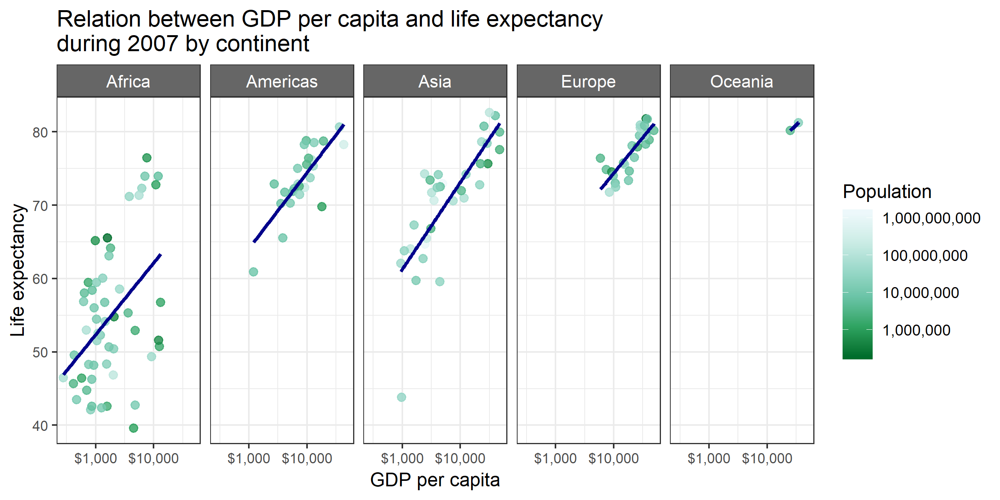

Homework 04: Tidy data and joins
================
Cecilia Leon

-   [Homework 05: Factor and figure management](#homework-05-factor-and-figure-management)
    -   [Overview](#overview)
    -   [The Assignment](#the-assignment)
        -   [Part 1: Factor management](#part-1-factor-management)
        -   [Part 2: File I/O](#part-2-file-io)
        -   [Part 3: Visualization design](#part-3-visualization-design)
        -   [Part 4: Writing figures to file](#part-4-writing-figures-to-file)
        -   [Final observation](#final-observation)

Homework 05: Factor and figure management
=========================================

Overview
--------

Goals:

-   Reorder a factor in a principled way based on the data and demonstrate the effect in arranged data and in figures.
-   Write some data to file and load it back into R.
-   Improve a figure (or make one from scratch), using new knowledge, e.g., control the color scheme, use factor levels, smoother mechanics.
-   Make a plotly visual.
-   Implement visualization design principles.

Remember the [sampler concept](http://en.wikipedia.org/wiki/Sampler_(needlework)). Your homework should serve as your own personal cheatsheet in the future for canonical tasks. Make things nice -- your future self will thank you!

The Assignment
--------------

### Part 1: Factor management

With the data set of your choice, after ensuring the variable(s) you're exploring are indeed factors, you are expected to:

1.  Drop factor / levels;
2.  Reorder levels based on knowledge from data.

We've elaborated on these steps for the gapminder and singer data sets below.

Be sure to also characterize the (derived) data before and after your factor re-leveling:

-   Explore the effects of `arrange()`. Does merely arranging the data have any effect on, say, a figure?
-   Explore the effects of reordering a factor and factor reordering coupled with `arrange()`. Especially, what effect does this have on a figure?

These explorations should involve the data, the factor levels, and some figures.

#### Elaboration for the gapminder data set

All dependencies used for this asssigment

``` r
suppressPackageStartupMessages(library(tidyverse))
library(ggplot2)
library(gapminder)
library(knitr)
library(kableExtra)
library(forcats)
library(scales)
```

    ## 
    ## Attaching package: 'scales'

    ## The following object is masked from 'package:purrr':
    ## 
    ##     discard

    ## The following object is masked from 'package:readr':
    ## 
    ##     col_factor

``` r
knitr::opts_chunk$set(echo = TRUE)
```

**i) Drop Oceania.** Filter the Gapminder data to remove observations associated with the `continent` of Oceania. Additionally, remove unused factor levels. Provide concrete information on the data before and after removing these rows and Oceania; address the number of rows and the levels of the affected factors.

First of all we are going to ensure that `gapmider`dataframe cotains factor data:

``` r
str(gapminder)
```

    ## Classes 'tbl_df', 'tbl' and 'data.frame':    1704 obs. of  6 variables:
    ##  $ country  : Factor w/ 142 levels "Afghanistan",..: 1 1 1 1 1 1 1 1 1 1 ...
    ##  $ continent: Factor w/ 5 levels "Africa","Americas",..: 3 3 3 3 3 3 3 3 3 3 ...
    ##  $ year     : int  1952 1957 1962 1967 1972 1977 1982 1987 1992 1997 ...
    ##  $ lifeExp  : num  28.8 30.3 32 34 36.1 ...
    ##  $ pop      : int  8425333 9240934 10267083 11537966 13079460 14880372 12881816 13867957 16317921 22227415 ...
    ##  $ gdpPercap: num  779 821 853 836 740 ...

As we can see by using command `str()` this dataframe has two variables of type **factor**, which are:

| Variable  | Levels |
|-----------|--------|
| country   | 142    |
| continent | 5      |

Then, if we filter by continents that are not *Oceania* we have:

``` r
gapminder %>% 
  filter(continent != "Oceania") %>% 
  str() 
```

    ## Classes 'tbl_df', 'tbl' and 'data.frame':    1680 obs. of  6 variables:
    ##  $ country  : Factor w/ 142 levels "Afghanistan",..: 1 1 1 1 1 1 1 1 1 1 ...
    ##  $ continent: Factor w/ 5 levels "Africa","Americas",..: 3 3 3 3 3 3 3 3 3 3 ...
    ##  $ year     : int  1952 1957 1962 1967 1972 1977 1982 1987 1992 1997 ...
    ##  $ lifeExp  : num  28.8 30.3 32 34 36.1 ...
    ##  $ pop      : int  8425333 9240934 10267083 11537966 13079460 14880372 12881816 13867957 16317921 22227415 ...
    ##  $ gdpPercap: num  779 821 853 836 740 ...

When we filter by condition `continent != "Oceania"` we can note that both *continent* and *country* keep the same number of levels without filtering, this happens because we have empty levels on the filtered dataframe. In order to drop this kind of levels we can use `droplevels()`:

``` r
gapminder %>% 
  filter(continent != "Oceania") %>% 
  droplevels() %>% 
  str()
```

    ## Classes 'tbl_df', 'tbl' and 'data.frame':    1680 obs. of  6 variables:
    ##  $ country  : Factor w/ 140 levels "Afghanistan",..: 1 1 1 1 1 1 1 1 1 1 ...
    ##  $ continent: Factor w/ 4 levels "Africa","Americas",..: 3 3 3 3 3 3 3 3 3 3 ...
    ##  $ year     : int  1952 1957 1962 1967 1972 1977 1982 1987 1992 1997 ...
    ##  $ lifeExp  : num  28.8 30.3 32 34 36.1 ...
    ##  $ pop      : int  8425333 9240934 10267083 11537966 13079460 14880372 12881816 13867957 16317921 22227415 ...
    ##  $ gdpPercap: num  779 821 853 836 740 ...

This time, the number of levels for continent changed from **5** to **4** as we dropped one level (*Oceania*). Furthermore, the number of levels in country changed from **142** to **140**, which means there were two countries associated to the continent Oceania. We can confirm that statement by:

``` r
gapminder %>% 
   filter(continent == "Oceania") %>% 
   droplevels() %>% 
   str()
```

    ## Classes 'tbl_df', 'tbl' and 'data.frame':    24 obs. of  6 variables:
    ##  $ country  : Factor w/ 2 levels "Australia","New Zealand": 1 1 1 1 1 1 1 1 1 1 ...
    ##  $ continent: Factor w/ 1 level "Oceania": 1 1 1 1 1 1 1 1 1 1 ...
    ##  $ year     : int  1952 1957 1962 1967 1972 1977 1982 1987 1992 1997 ...
    ##  $ lifeExp  : num  69.1 70.3 70.9 71.1 71.9 ...
    ##  $ pop      : int  8691212 9712569 10794968 11872264 13177000 14074100 15184200 16257249 17481977 18565243 ...
    ##  $ gdpPercap: num  10040 10950 12217 14526 16789 ...

Finally, we can known the number of countries per continent on this data frame by:

``` r
gapminder %>% 
 filter(continent != "Oceania") %>% 
 droplevels() %>% 
 select(country, continent) %>% 
 group_by(continent) %>% 
 summarize(total = length(unique(country))) %>% 
 kable(col.names=c("Continent","Number of levels (countries)"))
```

<table>
<thead>
<tr>
<th style="text-align:left;">
Continent
</th>
<th style="text-align:right;">
Number of levels (countries)
</th>
</tr>
</thead>
<tbody>
<tr>
<td style="text-align:left;">
Africa
</td>
<td style="text-align:right;">
52
</td>
</tr>
<tr>
<td style="text-align:left;">
Americas
</td>
<td style="text-align:right;">
25
</td>
</tr>
<tr>
<td style="text-align:left;">
Asia
</td>
<td style="text-align:right;">
33
</td>
</tr>
<tr>
<td style="text-align:left;">
Europe
</td>
<td style="text-align:right;">
30
</td>
</tr>
</tbody>
</table>
Thus, we can confirm the other 140 levels correspond to the rest of continents.

**ii) Reorder the levels of `country` or `continent`.** Use the forcats package to change the order of the factor levels, based on a principled summary of one of the quantitative variables. Consider experimenting with a summary statistic beyond the most basic choice of the median.

If we dont't apply any kind of `arrange`to the dataframe, **R** consider the levels of a factor un alphabetic order. We can illustrate this by the following graph of number of observations by continent:

``` r
first_plot <- ggplot(gapminder,aes(continent, fill = continent)) +
                geom_bar() +
                ggtitle("Observations on gapminder dataframe by continent") +
                xlab("Continent\n(In alphabetic order)") +
                ylab("Number of observations")
first_plot
```


But we can provide a different cirteria for the order of factors, for example, if we want to show the number of observations in the dataframe by continent, considering the order given by the `spreadness`of \*\*life expectancy\*:

``` r
gapminder %>%
  mutate(continent = fct_reorder(continent, lifeExp, .fun = sd)) %>% 
  ggplot(aes(continent, fill = continent)) +
  geom_bar() +
  ggtitle("Observations on gapminder dataframe by continent") +
  xlab("Continent\n(From the highest spreadness of life expectancy to the lowest)") +
  ylab("Number of observations")
```


It allows to appreciate how *Oceania*, which was the continent with the fewest number of observations has the greatest variability on the records of life expectancy, while Asia was the continent that presented the fewest variable life expectancy even when it has not the biggest number of observations in the dataframe.

In the following example we are going to show the gdp per capita of the countries of America during 2007, ordering this countries by life expectancy and gdp Per capita from lowest to highest:

``` r
gapminder %>% 
  filter(continent == "Americas" , year == 2007) %>% 
  mutate(country = fct_reorder2(country, lifeExp, gdpPercap)) %>% 
  ggplot(aes(gdpPercap,country)) +
  geom_point(aes(gdpPercap, colour=lifeExp)) +
  ggtitle("Countries of Americas' GDP per capita and Life Expectancy") +
  xlab("GDP per capita") +
  ylab("Countries\n(Ordered by GDP per capita and life expectancy)")
```


### Part 2: File I/O

Experiment with one or more of `write_csv()/read_csv()` (and/or TSV friends), `saveRDS()/readRDS()`, `dput()/dget()`. Create something new, probably by filtering or grouped-summarization of Singer or Gapminder. I highly recommend you fiddle with the factor levels, i.e. make them non-alphabetical (see previous section). Explore whether this survives the round trip of writing to file then reading back in.

We are going to create a new factor variable called **category** and the export the new dataframe (without chaging the levels of this factor) to a file with format `csv`.

``` r
gap_to_export <- gapminder %>% 
                    mutate(category = factor(ifelse(lifeExp>mean(lifeExp),
                                             "Over world's mean",
                                             "Under world's mean")))

write_csv(gap_to_export,"new_gapminder.csv")
```

Then, when we read it again:

``` r
read_csv("new_gapminder.csv") %>%  str()
```

    ## Parsed with column specification:
    ## cols(
    ##   country = col_character(),
    ##   continent = col_character(),
    ##   year = col_integer(),
    ##   lifeExp = col_double(),
    ##   pop = col_integer(),
    ##   gdpPercap = col_double(),
    ##   category = col_character()
    ## )

    ## Classes 'tbl_df', 'tbl' and 'data.frame':    1704 obs. of  7 variables:
    ##  $ country  : chr  "Afghanistan" "Afghanistan" "Afghanistan" "Afghanistan" ...
    ##  $ continent: chr  "Asia" "Asia" "Asia" "Asia" ...
    ##  $ year     : int  1952 1957 1962 1967 1972 1977 1982 1987 1992 1997 ...
    ##  $ lifeExp  : num  28.8 30.3 32 34 36.1 ...
    ##  $ pop      : int  8425333 9240934 10267083 11537966 13079460 14880372 12881816 13867957 16317921 22227415 ...
    ##  $ gdpPercap: num  779 821 853 836 740 ...
    ##  $ category : chr  "Under world's mean" "Under world's mean" "Under world's mean" "Under world's mean" ...
    ##  - attr(*, "spec")=List of 2
    ##   ..$ cols   :List of 7
    ##   .. ..$ country  : list()
    ##   .. .. ..- attr(*, "class")= chr  "collector_character" "collector"
    ##   .. ..$ continent: list()
    ##   .. .. ..- attr(*, "class")= chr  "collector_character" "collector"
    ##   .. ..$ year     : list()
    ##   .. .. ..- attr(*, "class")= chr  "collector_integer" "collector"
    ##   .. ..$ lifeExp  : list()
    ##   .. .. ..- attr(*, "class")= chr  "collector_double" "collector"
    ##   .. ..$ pop      : list()
    ##   .. .. ..- attr(*, "class")= chr  "collector_integer" "collector"
    ##   .. ..$ gdpPercap: list()
    ##   .. .. ..- attr(*, "class")= chr  "collector_double" "collector"
    ##   .. ..$ category : list()
    ##   .. .. ..- attr(*, "class")= chr  "collector_character" "collector"
    ##   ..$ default: list()
    ##   .. ..- attr(*, "class")= chr  "collector_guess" "collector"
    ##   ..- attr(*, "class")= chr "col_spec"

We can realize that the format for variables of type **factor** changed to **character**. One to handle this problem is using command `read.csv` instead of `read_csv`in order to use the parameters `colClasses`:

``` r
data <- read.csv('new_gapminder.csv', colClasses = c(rep('factor',2),rep('numeric',4),'factor')) %>% str()
```

    ## 'data.frame':    1704 obs. of  7 variables:
    ##  $ country  : Factor w/ 142 levels "Afghanistan",..: 1 1 1 1 1 1 1 1 1 1 ...
    ##  $ continent: Factor w/ 5 levels "Africa","Americas",..: 3 3 3 3 3 3 3 3 3 3 ...
    ##  $ year     : num  1952 1957 1962 1967 1972 ...
    ##  $ lifeExp  : num  28.8 30.3 32 34 36.1 ...
    ##  $ pop      : num  8425333 9240934 10267083 11537966 13079460 ...
    ##  $ gdpPercap: num  779 821 853 836 740 ...
    ##  $ category : Factor w/ 2 levels "Over world's mean",..: 2 2 2 2 2 2 2 2 2 2 ...

### Part 3: Visualization design

Remake at least one figure or create a new one, in light of something you learned in the recent class meetings about visualization design and color. Maybe juxtapose your first attempt and what you obtained after some time spent working on it. Reflect on the differences. If using Gapminder, you can use the country or continent color scheme that ships with Gapminder. Consult the dimensions listed in [All the Graph Things](http://stat545.com/graph00_index.html).

Then, make a new graph by converting this visual (or another, if you'd like) to a `plotly` graph. What are some things that `plotly` makes possible, that are not possible with a regular `ggplot2` graph?

First, we are going to draw a graph that illustrates the relation between the GDP per capita and life expectancy during 2007 by continent:

``` r
gap_to_export %>%
  filter(year==2007) %>% 
  ggplot(aes(gdpPercap,lifeExp)) +
  geom_point(aes(colour=pop), alpha=0.80, size = 2) +
  geom_smooth(method = "lm") +
  facet_grid(~continent) 
```

    ## Warning in qt((1 - level)/2, df): NaNs produced


By modifiyind and adding some elements using `theme()`, the package `scales` and a different palette of colors, we can privide a different aspect to the same graph:

``` r
improved_plot <- gap_to_export %>%
    rename(Population = pop) %>% 
    filter(year==2007) %>% 
    ggplot(aes(gdpPercap,lifeExp)) +
    geom_point(aes(colour=Population), alpha=0.80, size = 2) +
    geom_smooth(method = "lm", color="darkblue", se = FALSE) +
    facet_grid(~continent) +
    ggtitle("Relation between GDP per capita and life expectancy\nduring 2007 by continent") +
    xlab("GDP per capita") +
    ylab("Life expectancy") +
    #Making clearer the scale of x
    scale_x_log10(labels=dollar_format()) + 
    #Applying a different palette of colors
    scale_color_distiller(
          trans   = "log10",
          breaks  = 10^(1:10),
          labels  = comma_format(),
          palette = "BuGn"
      ) +
    #Using a pre-determined theme for general aspect
    theme_bw() +
    #Modifiying some especific elements 
    theme(axis.text = element_text(size = 8),
          strip.background = element_rect(fill = "gray40"),
          strip.text = element_text(size = 10, colour = "white"))
```

We can convert this last plot to a plot of tyoe `plotly`by the following code.

``` r
library(plotly)
ggplotly(improved_plot)
```


**Note:** As ploty graphs doesn´t are correctly rendered in markdown documents, it is necesary to run this code in an R session in order to interact with the produced plot.

When I runned this lines on my local session, I can realize that the main difference between `ggplot`and `plotly` is that the latter allows the user to have interaction with the graphs by making some zooms over a specif zone of the graph, also it provides tooltips when hover the mouse over the points in the plot, that tolltips provide information such as the corresponding values of each point.

### Part 4: Writing figures to file

Use `ggsave()` to explicitly save a plot to file. Then use `` to load and embed it in your report. You can play around with various options, such as:

-   Arguments of `ggsave()`, such as width, height, resolution or text scaling.
-   Various graphics devices, e.g. a vector vs. raster format.
-   Explicit provision of the plot object `p` via `ggsave(..., plot = p)`. Show a situation in which this actually matters.

To save our last graph we can use the command `ggsave()` and set different options, for example:

-   To save the plot with determined width and height and with **raster** device (png):

``` r
ggsave("ggplot_modified_theme.png", width = 8, height = 4, dpi="retina")
```

-   To save the same plot put in a **vector** format

``` r
ggsave("ggplot_modified_theme.pdf", width = 8, height = 4)
```

And then we can place the **raster** graph in this part on the document by typing ``

 We can also place the **vector** graph in this part on the document by typing ``

> Please, click the link to see that image 

-   Finally, the **provision of the plot object matters when** we want to save an image which wasn't our most recent produced plot, for example if we want to save the first graph of this document, which was a barplot loaded in the object `first_plot`, we can do it in this part of the document by:

``` r
ggsave("ggplot_first_barplot.png", width = 8, height = 4, plot = first_plot)
```

Then we can place thour graph in any part of the document by typing ``


### Final observation

To explore the `plotly`graphs appeared to me to be kind of similar to the graphs that we can built using the `highcharter` package, which allos R to draw graphs of the style of [!highcharts](https://www.highcharts.com/), with interactive plots. A brief general example of thos library is given by the following graph, wich is the same as the first bar plot we built with `ggplot`.

``` r
library(highcharter)

highchart() %>%
   hc_add_series(data = unname(table(gapminder$continent)), type = "column") %>% 
   hc_xAxis(categories = names(table(gapminder$continent))) %>% 
    hc_plotOptions(
      series = list(
        showInLegend = FALSE
        ),
      column = list(
        colorByPoint = TRUE
      ))
```


**Note:** Similarly to the case of ploty graphs, it is necesary to run this code in an R session in order to interact with the produced plot.
